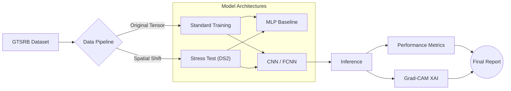

# 🚦 Traffic Sign Spatial Recognition & XAI


> **Comparative analysis of spatial invariance in Neural Networks and Explainable AI (XAI) for Autonomous Driving perception systems.**

This project quantifies the impact of **Inductive Bias** in Computer Vision architectures. It explores the catastrophic failure of **Dense Networks (MLP)** regarding **Spatial Invariance** compared to Convolutional Networks (CNN). The pipeline includes a custom "Shifted Dataset" generation to stress-test the models and utilizes **Grad-CAM** to audit the decision-making process, ensuring the model focuses on semantic features (pictograms) rather than contextual noise.

---

## 💡 Project Overview

In **Autonomous Driving**, a perception system must be robust against camera vibrations or misalignment. A stop sign is a stop sign, regardless of its position in the frame. This project empirically proves why the lack of spatial invariance in MLPs makes them unsuitable for raw pixel processing.

**Key Technical Capabilities:**

* **🛡️ Robustness Auditing:** Implementation of a custom data pipeline to create `ds2` (Shifted Dataset), rigorously testing translational invariance.
* **📊 Architecture Benchmarking:** A/B testing between MLP (Flattened input) and CNN (Spatial input) under stress conditions.
* **🧠 Explainable AI (XAI):** Integration of `pytorch-grad-cam` to generate Saliency Maps, verifying that the model learns the object's semantics and not background bias.
* **🔄 Data Augmentation Pipeline:** Using affine transformations to improve generalization on the validation set.

---

## 🏗️ System Architecture

The pipeline demonstrates the complete lifecycle from raw tensor processing to model auditing.



---

## 🧪 Experiments & Results

The core experiment involved training models on centered data and testing them on spatially shifted data to measure **Generalization Capability**.

### 1. The "Shift" Hypothesis

We tested the hypothesis that **Dense Networks** overfit to specific pixel coordinates. A synthetic dataset (`ds2`) was created where traffic signs were randomly translated within the 32x32 canvas.

### 2. Quantitative Results

| Model Architecture | Inductive Bias | Test Accuracy (Shifted Data) | Technical Conclusion |
| --- | --- | --- | --- |
| **MLP (Dense)** | None | **~24.2%** ❌ | **Catastrophic Failure.** Flattening the input destroys spatial topology; the model treats shifted pixels as entirely new features. |
| **FCNN / CNN** | Spatial | **~83.5%** ✅ | **Robust.** Convolutional kernels share weights across the input, effectively detecting features regardless of position. |

---

## 🛠️ Tech Stack

* **Deep Learning Framework:** PyTorch (`torch`, `torchvision`, `nn.Module`).
* **Data Manipulation:** NumPy (tensor operations), Pandas (logging).
* **Visualization:** Matplotlib, Seaborn, IPyWidgets (interactive analysis).
* **Interpretability:** `pytorch-grad-cam` (Gradient-weighted Class Activation Mapping).

---

## 🚀 Installation & Usage

### 1. Clone the repository

```bash
git clone https://github.com/Hugo31810/traffic-sign-spatial-recognition.git
cd traffic-sign-spatial-recognition

```

### 2. Install Dependencies

```bash
pip install torch torchvision matplotlib pandas scikit-learn pytorch-grad-cam opencv-python-headless

```

### 3. Run the Analysis

The project is structured in sequential notebooks for reproducibility:

1. **`01_Dataset_Prep.ipynb`**: Data downloading, preprocessing, and "Shifted Dataset" creation.
2. **`02_MLP_Baseline.ipynb`**: Training the Dense Network and analyzing the high error rate on `ds2`.
3. **`03_CNN_Architecture.ipynb`**: Implementing the robust CNN/FCNN architecture and comparing metrics.
4. **`04_XAI_Visualization.ipynb`**: Running Grad-CAM and filter visualization hooks.

---

## 📂 Project Structure

```text
.
├── metrics/                # CSV logs for Loss/Accuracy curves
│   ├── train_loss_cnn.csv
│   └── test_acc_mlp.csv
├── models/                 # Saved .pth state dictionaries (Inference ready)
├── notebooks/              # Jupyter Notebooks (Source Code)
├── src/                    # Python helper modules
├── assets/                 # Images for README
└── README.md

```

---

## 👨‍💻 Author

**Hugo Salvador Aizpún**

*Degree in Artificial Intelligence*
*Focus: Computer Vision & Deep Learning*

[GitHub Profile](https://www.google.com/search?q=https://github.com/Hugo31810)
